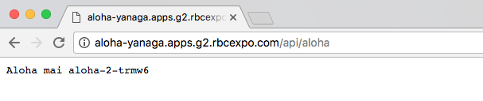

// JBoss, Home of Professional Open Source
// Copyright 2016, Red Hat, Inc. and/or its affiliates, and individual
// contributors by the @authors tag. See the copyright.txt in the
// distribution for a full listing of individual contributors.
//
// Licensed under the Apache License, Version 2.0 (the "License");
// you may not use this file except in compliance with the License.
// You may obtain a copy of the License at
// http://www.apache.org/licenses/LICENSE-2.0
// Unless required by applicable law or agreed to in writing, software
// distributed under the License is distributed on an "AS IS" BASIS,
// WITHOUT WARRANTIES OR CONDITIONS OF ANY KIND, either express or implied.
// See the License for the specific language governing permissions and
// limitations under the License.

### Building and Deploying your own application
Duration: 15:00

You will receive the information about the zip file containing the files of the aloha application. Please contact one of the instructors if you didn't receive this information.

Once you have unpacked the zip file containing the aloha application, switch to the application's folder and run a Maven build:

[source, bash, subs="normal,attributes"]
----
$ *cd aloha*
$ *mvn clean package*
----

Now that we created the local artifact, let's configure OpenShift to deploy our new artifact as an OpenShift application.

First we create a new build configuration in OpenShift:

[source, bash, subs="normal,attributes"]
----
$ *oc new-build --binary --name=aloha --allow-missing-images*
* A Docker build using binary input will be created
  * The resulting image will be pushed to image stream "aloha:latest"
  * A binary build was created, use 'start-build --from-dir' to trigger a new build

--> Creating resources with label build=aloha ...
imagestream "aloha" created
buildconfig "aloha" created
--> Success
----

Then we will tell OpenShift to start a new build from current folder. It will send all the contents of the content folder to the OpenShift daemon so it can create a new container image for us:

[source, bash, subs="normal,attributes"]
----
$ *oc start-build aloha --from-dir=. --follow*
Uploading directory "." as binary input for the build ...
build "aloha-3" started
Receiving source from STDIN as archive ...
Step 1 : FROM fabric8/java-jboss-openjdk8-jdk:1.1.7
 ---> c3965661b2b7
Step 2 : ENV JAVA_APP_JAR aloha-fat.jar
 ---> Using cache
 ---> 99ebd7ea4d1e
Step 3 : ENV AB_ENABLED jolokia
 ---> Using cache
 ---> 9a8cebb4a151
Step 4 : ENV AB_JOLOKIA_AUTH_OPENSHIFT true
 ---> Using cache
 ---> b32d3c0eb448
Step 5 : ENV JAVA_OPTIONS -Xmx256m
 ---> Using cache
 ---> 38c343db1b36
Step 6 : ENV ZIPKIN_SERVER_URL http://zipkin-query:9411
 ---> Using cache
 ---> 68af2e79492a
Step 7 : EXPOSE 8080
 ---> Using cache
 ---> ee06802bde6b
Step 8 : RUN chmod -R 777 /app/
 ---> Using cache
 ---> 46cb0f66d9d2
Step 9 : ADD target/aloha-fat.jar /app/
 ---> Using cache
 ---> 7c23662fb23d
Step 10 : ENV "OPENSHIFT_BUILD_NAME" "aloha-3" "OPENSHIFT_BUILD_NAMESPACE" "yanaga"
 ---> Running in 190d822da197
 ---> 4ed3d8a606fe
Removing intermediate container 190d822da197
Step 11 : LABEL "io.openshift.build.name" "aloha-3" "io.openshift.build.namespace" "yanaga"
 ---> Running in 5c8e4acce077
 ---> 38cfd7b72b4c
Removing intermediate container 5c8e4acce077
Successfully built 38cfd7b72b4c
Pushing image docker-registry.default.svc:5000/yanaga/aloha:latest ...
Pushed 1/15 layers, 7% complete
Pushed 2/15 layers, 13% complete
Pushed 3/15 layers, 20% complete
Pushed 4/15 layers, 27% complete
Pushed 5/15 layers, 33% complete
Pushed 6/15 layers, 40% complete
Pushed 7/15 layers, 47% complete
Pushed 8/15 layers, 53% complete
Pushed 9/15 layers, 60% complete
Pushed 10/15 layers, 67% complete
Pushed 11/15 layers, 73% complete
Pushed 12/15 layers, 80% complete
Pushed 13/15 layers, 87% complete
Pushed 14/15 layers, 93% complete
Pushed 15/15 layers, 100% complete
Push successful
----

Now we have a container image ready to be deployed in our OpenShift environment. OpenShift uses the term "Application" for the deployment and execution of container images:

[source, bash, subs="normal,attributes"]
----
$ *oc new-app aloha*
--> Found image 38cfd7b (2 minutes old) in image stream "yanaga/aloha" under tag "latest" for "aloha"

    * This image will be deployed in deployment config "aloha"
    * Ports 8080/tcp, 8778/tcp, 9779/tcp will be load balanced by service "aloha"
      * Other containers can access this service through the hostname "aloha"

--> Creating resources ...
    deploymentconfig "aloha" created
    service "aloha" created
--> Success
    Run 'oc status' to view your app.
----

Now create a route as explained on <<openshift_route>> to be able to check our newly deployed application. If you check your route URL and append the +/api/aloha+ path to it you should see a message similar to this one:

Let's modify our application to check how OpenShift handles the updates. Modify line 104 of the file +src/main/java/com/redhat/developers/msa/aloha/AlohaVerticle.java+, and change the String "Aloha Mai" to "Bonjour de".

Execute a new Maven build:

[source, bash, subs="normal,attributes"]
----
$ *cd aloha*
$ *mvn clean package*
----

And start a new OpenShift build with the new artifact that you just created:

[source, bash, subs="normal,attributes"]
----
$ *oc start-build aloha --from-dir=. --follow*
Uploading directory "." as binary input for the build ...
build "aloha-4" started
Receiving source from STDIN as archive ...
Step 1 : FROM fabric8/java-jboss-openjdk8-jdk:1.1.7
 ---> c3965661b2b7
Step 2 : ENV JAVA_APP_JAR aloha-fat.jar
 ---> Using cache
 ---> 99ebd7ea4d1e
Step 3 : ENV AB_ENABLED jolokia
 ---> Using cache
 ---> 9a8cebb4a151
Step 4 : ENV AB_JOLOKIA_AUTH_OPENSHIFT true
 ---> Using cache
 ---> b32d3c0eb448
Step 5 : ENV JAVA_OPTIONS -Xmx256m
 ---> Using cache
 ---> 38c343db1b36
Step 6 : ENV ZIPKIN_SERVER_URL http://zipkin-query:9411
 ---> Using cache
 ---> 68af2e79492a
Step 7 : EXPOSE 8080
 ---> Using cache
 ---> ee06802bde6b
Step 8 : RUN chmod -R 777 /app/
 ---> Using cache
 ---> 46cb0f66d9d2
Step 9 : ADD target/aloha-fat.jar /app/
 ---> 5b0cdf862782
Removing intermediate container 031e8987fded
Step 10 : ENV "OPENSHIFT_BUILD_NAME" "aloha-4" "OPENSHIFT_BUILD_NAMESPACE" "yanaga"
 ---> Running in 74975c1217dd
 ---> 7ace2d91eaed
Removing intermediate container 74975c1217dd
Step 11 : LABEL "io.openshift.build.name" "aloha-4" "io.openshift.build.namespace" "yanaga"
 ---> Running in 50b7af7938ca
 ---> 9a8c9b8e51f4
Removing intermediate container 50b7af7938ca
Successfully built 9a8c9b8e51f4
Pushing image docker-registry.default.svc:5000/yanaga/aloha:latest ...
Pushed 2/15 layers, 13% complete
Pushed 3/15 layers, 20% complete
Pushed 4/15 layers, 27% complete
Pushed 5/15 layers, 33% complete
Pushed 6/15 layers, 40% complete
Pushed 7/15 layers, 47% complete
Pushed 8/15 layers, 53% complete
Pushed 9/15 layers, 60% complete
Pushed 10/15 layers, 67% complete
Pushed 11/15 layers, 74% complete
Pushed 12/15 layers, 80% complete
Pushed 13/15 layers, 87% complete
Pushed 14/15 layers, 100% complete
Pushed 15/15 layers, 100% complete
Push successful
----
