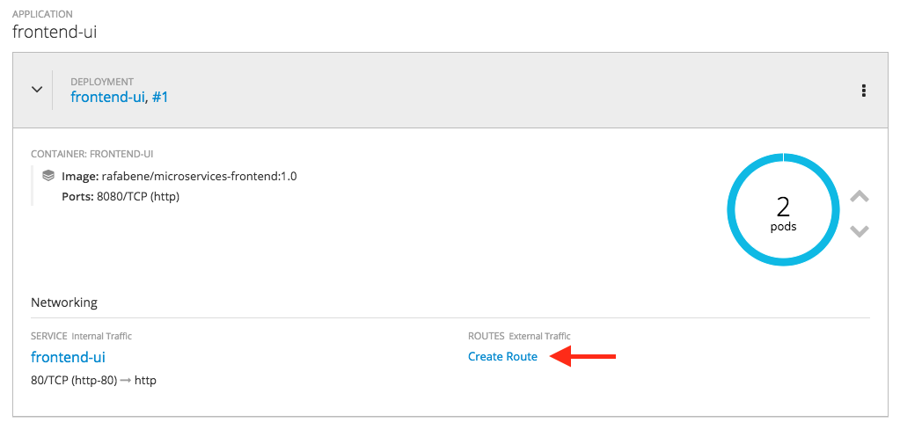
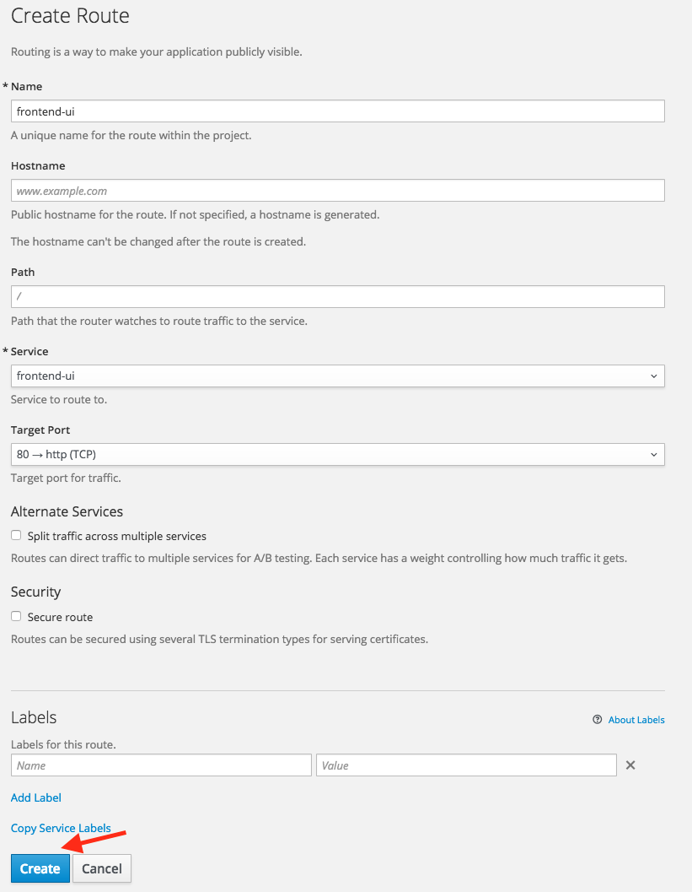

// JBoss, Home of Professional Open Source
// Copyright 2016, Red Hat, Inc. and/or its affiliates, and individual
// contributors by the @authors tag. See the copyright.txt in the
// distribution for a full listing of individual contributors.
//
// Licensed under the Apache License, Version 2.0 (the "License");
// you may not use this file except in compliance with the License.
// You may obtain a copy of the License at
// http://www.apache.org/licenses/LICENSE-2.0
// Unless required by applicable law or agreed to in writing, software
// distributed under the License is distributed on an "AS IS" BASIS,
// WITHOUT WARRANTIES OR CONDITIONS OF ANY KIND, either express or implied.
// See the License for the specific language governing permissions and
// limitations under the License.

### Accessing the frontend
Duration: 5:00

Not all of our artifacts need to be externally accessible. In fact, most of them should be securely hidden from the public. That's why OpenShift never exposes your artifacts to the public by default. You need to explicitly take action to make the accessible. In OpenShift terminology, you need to create a *Route* to make any of your services exposed. We'll create a route using the OpenShift console.

Let's create a route for the frontend-ui service that we have previously deployed. Check your OpenShift console and look for the "Create route" link on the frontend-ui service.

Once you click on the link, you will be redirect to the "Create Route Screen". Click on the "Create" button, as the default values should be good for most of the cases.

image::images/app-screenshot.png[App Screenshot,float="center",align="center"]
